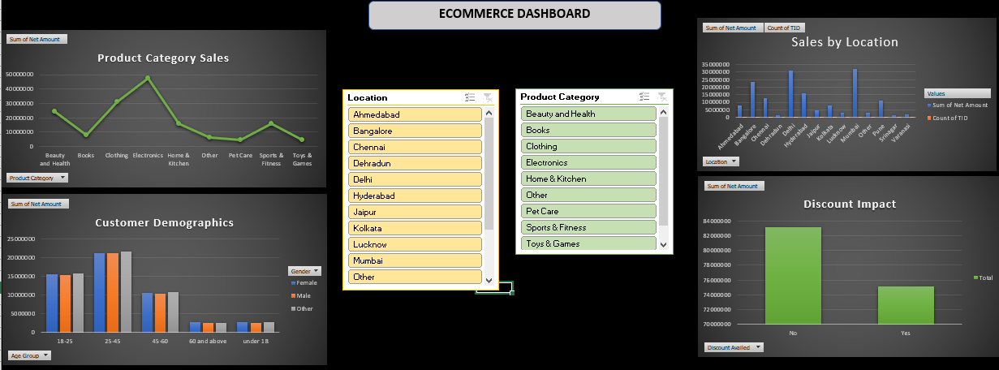

# 📊 E-Commerce Sales Dashboard (Excel Project)

This project showcases an **E-Commerce Sales Analysis Dashboard** built entirely in **Excel**.  
The dataset contains **55,000 synthetic customer transactions**, generated using Python’s Faker library, designed to simulate real-world retail data.  

---

## 🔑 Project Workflow
1. **Data Cleaning**
   - Removed inconsistencies
   - Handled missing values
   - Formatted purchase dates
   - Structured categorical fields  

2. **Pivot Tables**
   - Sales by **Location**
   - Sales by **Product Category**
   - Analysis by **Gender & Age Group**
   - Discounts impact
   - Payment methods  

3. **Dashboard Design**
   - Combined pivot charts
   - Added slicers for interactivity
   - Designed a professional **E-Commerce Insights Dashboard**

---

## 📊 Key Insights
- **Top-selling categories**: Clothing and Electronics  
- **Customer demographics**: Majority of purchases come from the **25–45 age group**  
- **Location trends**: Cities like **Bangalore and Delhi** drive the highest sales  
- **Discounts**: Customers who did **not** avail discounts contributed higher overall revenue  

---

## 📂 Repository Contents
- `Ecommerce_Sales_Dashboard.xlsx` → The cleaned dataset, pivot tables, and final dashboard  
- `dashboard_screenshot.png` → Screenshot of the final Excel dashboard  

---

## 🛠 Tools Used
- **Microsoft Excel**
  - Data Cleaning
  - Pivot Tables
  - Charts & Visualization
  - Dashboard Design  

---

## 🚀 Learning Outcomes
- Strengthened skills in **Excel data cleaning**  
- Hands-on practice with **Pivot Tables & Charts**  
- Built a professional **interactive dashboard**  
- Improved ability to **present data-driven insights**  

---

## 📷 Dashboard Preview

---

✨ *This project was built as part of my data analytics learning journey. Excited to apply these skills to real-world datasets!*  
